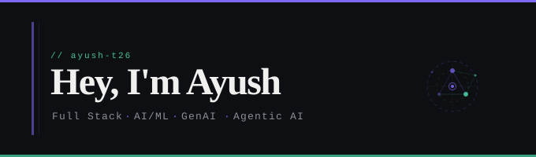

## 👤 About Me

🔭 Building open-source tools & GenAI projects  
🤝 Open to collaborate on React, Node.js & AI/ML  
📚 Learning TypeScript, backend systems & applied GenAI  
🛠️ Seeking help with scaling, system design & AI engineering  
💬 Ask me about DSA (C/C++), Python, AIML, Web Dev  
⚡ I build practical tools that solve real problems  

---

## 🌐 Socials

---

## 💻 Tech Stack

**Languages**  

**Full Stack**  

**AI / ML & GenAI**  

**Infra & Deployment**  

---

## 📊 GitHub Stats

---

